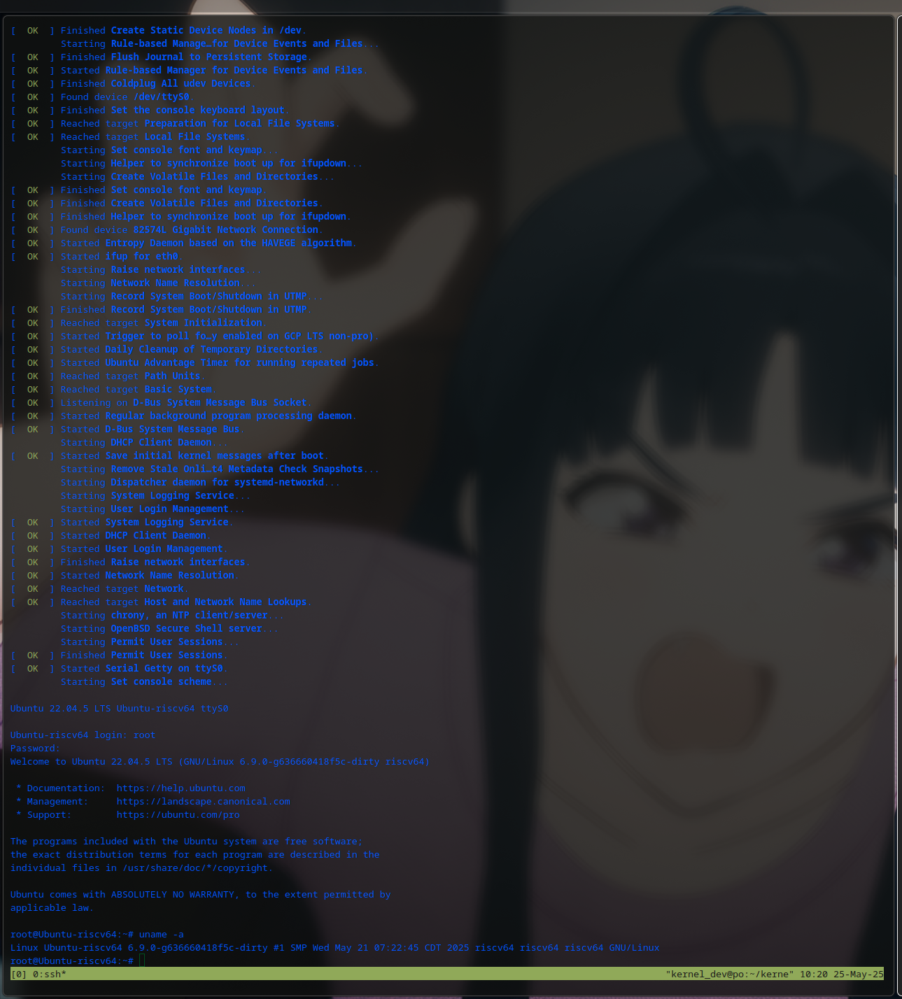

>  基于ubuntu，x86_64(thinkpad x230t), 对ubuntu-riscv有依赖
>


---

## 依赖

1. **apt包**

```
sudo apt update
sudo apt install -y git build-essential crossbuild-essential-riscv64 \
     libssl-dev flex bison bc device-tree-compiler debootstrap \
     qemu-user-static qemu-system-riscv64 gcc-riscv64-linux-gnu \
     python3-pip libelf-dev libdw-dev zlib1g-dev libcap-dev
```


2. **环境声明（可选）**

```
export WORKSPACE=/<path-to-workspace>
export ROOTFS=$WORKSPACE/rootfs
export LINUX=$WORKSPACE/linux
export QEMU=$WORKSPACE/qemu
export SYSROOT=$ROOTFS/temp-rootfs
cd $WORKSPACE
```

3. **内核定制**

```
CONFIG_RISCV_PMU=y 
CONFIG_IOMMU=y                
CONFIG_HW_PAGETABLE=y        
CONFIG_IOMMU_DMA_SUPPORT=y   
CONFIG_DMAR=y                
CONFIG_IOMMU_API=y           
CONFIG_PERF_EVENTS=y         
CONFIG_PERF_EVENTS_DEBUG=y   
CONFIG_RISCV_IOMMU_HPM=y      
CONFIG_IOMMU_PERFMON=y        
CONFIG_PERF_COUNT_SW_EVENT=y  
CONFIG_PERF_COUNT_HW_EVENT=y  
CONFIG_PERF_SAMPLE_IP=y       
CONFIG_NESTED_IOMMU=y         
CONFIG_IOMMU_NESTED=y         
CONFIG_IOMMU_STAGE1_SUPPORT=y
CONFIG_IOMMU_STAGE2_SUPPORT=y
CONFIG_IOMMU_IOTLB_SYNC=y     
CONFIG_IOMMU_GSTAGE_FLUSH=y   
CONFIG_DEBUG_IOMMU=y         
CONFIG_DEBUG_HW_PAGETABLE=y  
CONFIG_IOMMU_CACHE=y  
CONFIG_IOMMU_PASID=y  
CONFIG_IOMMU_SELFTEST=y   
CONFIG_EXPERIMENTAL=y     
```

直接`cd scripts;chmod +x enable_con.sh; ./enable_con.sh`

## 工具构建和制定

1. **qemu-riscv**

```
git clone --depth=1 -b ctr_upstream --recurse-submodules -j8 https://github.com/rajnesh-kanwal/qemu.git $QEMU
cd $QEMU
mkdir -p build && cd ./build
../configure --target-list="riscv64-softmmu" --enable-plugins
make -j$(nproc)
cd ../roms/
make opensbi64-generic
```

2. **linux kernel**


```
git clone --depth=1 -b riscv_iommu_v7 https://github.com/tjeznach/linux $LINUX
cd $LINUX # 有补丁可以用的话得先打上，现在不了（git am
mkdir -p build
export ARCH=riscv
export CROSS_COMPILE=riscv64-linux-gnu-
make defconfig
# 启用 IOMMU 和 HPM
./scripts/config -e IOMMU_SUPPORT -e RISCV_IOMMU -e RISCV_IOMMU_HPM -e PERF_EVENTS
make defconfig
make -j$(nproc)
```

3. **rootfs**
   - 预备rootfs

```
mkdir -p $ROOTFS && cd $ROOTFS

sudo -E PKG_CONFIG_LIBDIR="$SYSROOT/usr/lib/riscv64-linux-gnu/pkgconfig/" VF=1 make   EXTRA_CFLAGS="--sysroot=$SYSROOT"   ARCH=riscv  CROSS_COMPILE=riscv64-linux-gnu- NO_LIBBPF=1  prefix='$(SYSROOT)/usr' install
# 下载 Ubuntu RISC-V 根文件系统
# sudo debootstrap --arch=riscv64 --foreign jammy $ROOTFS http://ports.ubuntu.com/ubuntu-ports
# sudo cp /usr/bin/qemu-riscv64-static $ROOTFS/usr/bin/
# sudo chroot $ROOTFS /debootstrap/debootstrap --second-stage

# 配置基础环境
cd $ROOTFS
dd if=/dev/zero of=rootfs.ext4 bs=1G count=4
mkfs.ext4 rootfs.ext4
mkdir ./tmp
sudo mount rootfs.ext4 ./tmp
sudo cp -rp ./temp-rootfs/* ./tmp/
sudo umount ./tmp

```

-  制作ext4镜像

```
dd if=/dev/zero of=$ROOTFS/ubuntu-riscv.img bs=1G count=4
mkfs.ext4 $ROOTFS/ubuntu-riscv.img
sudo mkdir -p /mnt/riscv-root
sudo mount -o loop $ROOTFS/ubuntu-riscv.img /mnt/riscv-root
sudo cp -rp $ROOTFS/* /mnt/riscv-root/
sudo umount /mnt/riscv-root
```


4. **crossing-compile perf**

```
cd $LINUX/tools/perf

sudo -E PKG_CONFIG_LIBDIR="$SYSROOT/usr/lib/riscv64-linux-gnu/pkgconfig/" \
    make EXTRA_CFLAGS="--sysroot=$SYSROOT -I$SYSROOT/usr/include" \
    EXTRA_LDFLAGS="-L$SYSROOT/usr/lib/riscv64-linux-gnu" \
    ARCH=riscv CROSS_COMPILE=riscv64-linux-gnu- \
    NO_LIBBPF=1 NO_SDT=1 NO_LIBTRACEEVENT=1 NO_LIBAUDIT=1 \
    NO_LIBCRYPTO=1 NO_SLANG=1 NO_PERL=1 NO_PYTHON=1 \
    NO_LZMA=1 NO_ZSTD=1 NO_LIBCAP=1 NO_NUMA=1 \
    NO_BABELTRACE=1 NO_CAPSTONE=1 NO_PFMLIB=1 \
    prefix='/usr' install
sudo mount -o loop $ROOTFS/ubuntu-riscv.img /mnt/riscv-root
sudo make ARCH=riscv CROSS_COMPILE=riscv64-linux-gnu- \
     DESTDIR=/mnt/riscv-root install
sudo umount /mnt/riscv-root
```

或者

```
# 登录QEMU环境后执行
cd /usr/src/linux/tools/perf
make clean
make
make install
```

还有其他方法，比如魔改rootfs的部署脚本


5. **run**
   - 制作镜像文件和启动
   - iommu启动选项示意大致如下，不同设备间有不同情况


```
cd $ROOTFS
$QEMU/build/qemu-system-riscv64 \
  -M virt,aia=aplic-imsic -cpu rv64,smaia=true,ssaia=true \
  -m 8G -smp 4 -nographic \
  -kernel $LINUX/arch/riscv/boot/Image \
  -append "root=/dev/vda rw console=ttyS0 earlycon=sbi" \
  -drive file=$ROOTFS/ubuntu-riscv.img,format=raw,id=hd0 \
  -device virtio-blk-device,drive=hd0 \
  -netdev user,id=net0,hostfwd=tcp::2222-:22 \
  -device virtio-net-device,netdev=net0  
  
ssh -p 2222 root@localhost
# 密码: riscv，在rootfs那步配置好了
# 检查 PMU 事件
ls /sys/bus/event_source/devices/riscv_iommu/events
perf list

```

自此可以开始测试工作



## 测试
详见文件夹下的另外两个文件，HPM_TEST_REPORT.md和HPM_TEST_SAMPLE.md
1. [运行](./HPM_TEST_REPORT.md)
2. [测试](./HPM_TEST_SAMPLE.md)

